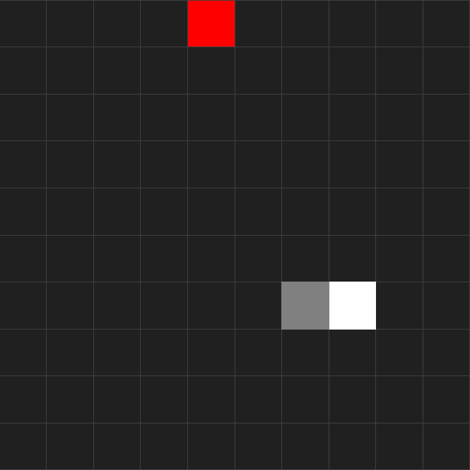
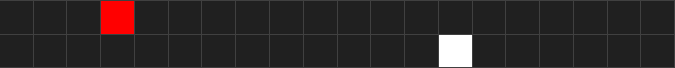
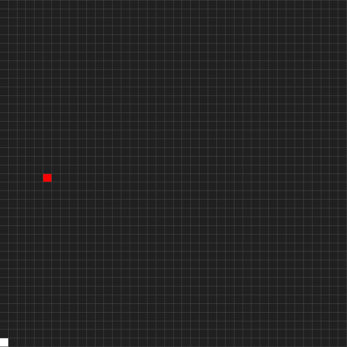

# Blind Snake Algorithm

This project implements the Blind Snake Algorithm to solve the problem of navigating a grid. For $S_{max} = 10^6$, the fastest algorithm finds the apple in $O(26 S)$ steps. You can find some details about approaches in [report.pdf](./report.pdf).

## Spiral Algorithm ($$O(S^2)$$)
You can find a more detailed explanation of the algorithm in [report.pdf](./report.pdf). Here you can see an example of the algorithm in action:

Also, an example of a grid where this algorithm operates in $O(S^2)$ steps:

## Fast Approach ($$O(26 S)$$)

You can find a more detailed explanation of the algorithm in [report.pdf](./report.pdf). Here you can see an example of the algorithm in action:

 

Also, an example of how it works on elongated grids:

 

## Usage 

The project contains the following files in the `src` directory:

- `gui.py`: Contains the GUI for the project. You can use it for experimenting with the algorithms.
- `FastAlgorithm.py`: Contains the implementation of the fast algorithm. This class has a generator `step` that returns the next move of the snake.
- `SpiralAlgorithm.py`: Contains the implementation of the spiral algorithm. This class has a generator `step` that returns the next move of the snake.

